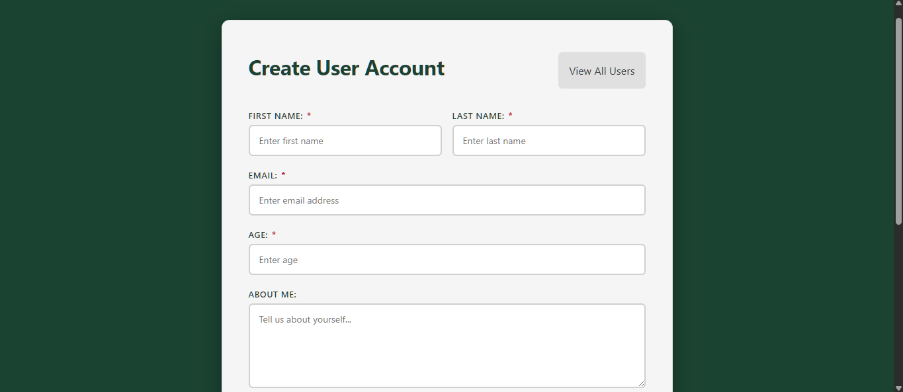
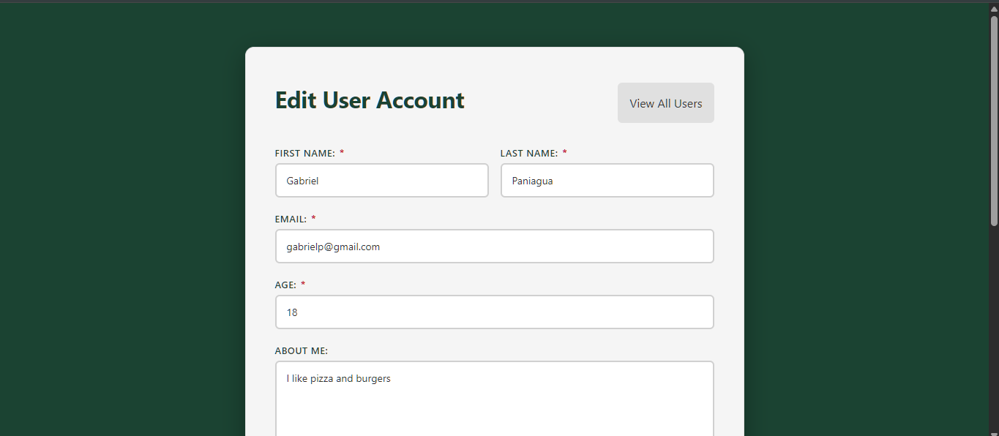

# User Management System

A full-stack CRUD application built with **Angular** and **Firebase (Firestore)**. Users can be created, viewed, edited, and deleted through a reactive interface with real-time Firestore persistence.

**Live Demo:** [Live Demo](https://user-management-system-a3ea7.web.app/user-create-component/1LPHUGmE6VGzZZYczUrP)

---

## Screenshots

### User List


### Create User


### Edit User


---

## Features

- **View all users** — card-based list displaying name, email, age, bio, hobbies, and premium status
- **Create users** — reactive form with validation across all fields
- **Edit users** — same form pre-populated with existing Firestore data
- **Delete users** — removes record from Firestore in real time
- **Dynamic hobbies** — add or remove individual hobbies per user
- **Premium flag** — mark users as premium with a visual badge on the list view
- **Service layer** — all Firestore operations are encapsulated behind a typed service interface; components have no direct database access

---

## Tech Stack

| Layer | Technology |
|---|---|
| Frontend Framework | Angular |
| Language | TypeScript |
| Forms | Angular Reactive Forms |
| Database | Firebase Firestore |
| Hosting | Firebase Hosting |
| Reactive Programming | RxJS |

---

## Architecture
```
src/
├── app/
│   ├── components/
│   │   ├── user-list/        # Displays all user cards
│   │   ├── create-user/      # Reactive form for new users
│   │   └── edit-user/        # Pre-populated form for updates
│   └── services/
│       └── users.service.ts  # Encapsulates all Firestore operations
├── models/
│   └── Users.ts              # User interface, service interface, and utility types
```

The service layer is driven by `UsersServiceInterface`, which defines the full contract for data access through the following methods `getAllUsers$()`, `getUserById$()`, `createUser()`, `updateUser()`, and `deleteUser()`. Components depend on that interface, not the concrete implementation, keeping Firestore details out of component logic entirely.

---

## Data Model
```typescript
interface User {
  id: string;
  firstName: string;
  lastName: string;
  email: string;
  age: number;
  aboutMe: string;
  hobbies: string[];
  premiumUser: boolean;
  imageUrl: string;
}
```

Utility types `UserUpdateFields` (`Partial<Omit<User, 'id'>>`) and `UserCollection` are defined alongside the interface in `models/Users.ts`.

---

## Author

**Gabriel Paniagua**
Computer Engineering Student — Wilbur Wright College (City Colleges of Chicago)
[LinkedIn](https://www.linkedin.com/in/gabriel-paniagua/) · [GitHub](https://github.com/GabrielP295)
